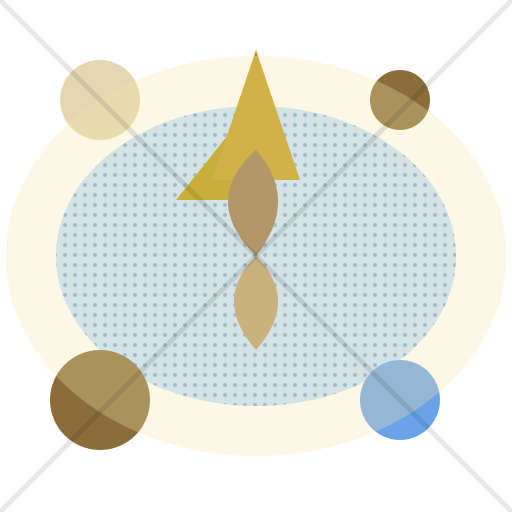
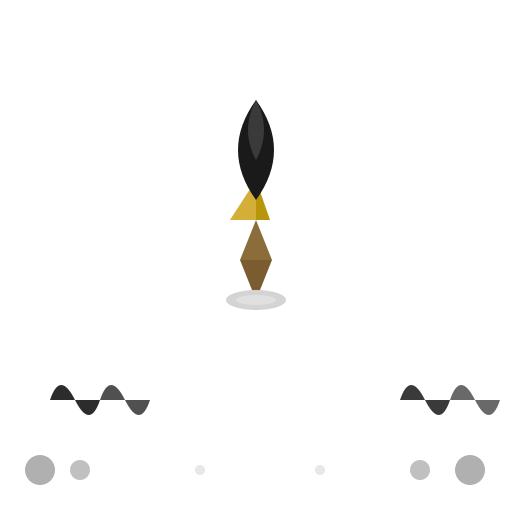
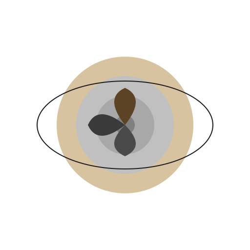
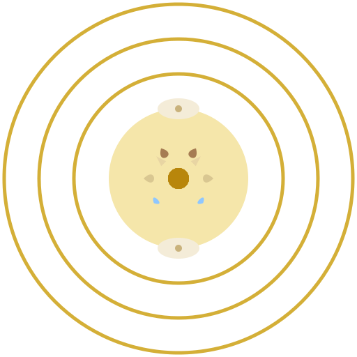
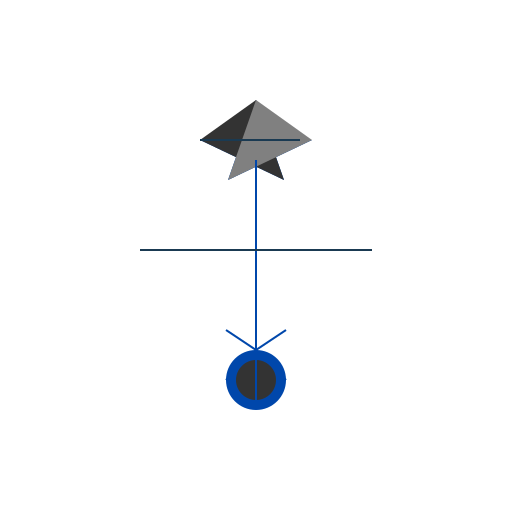
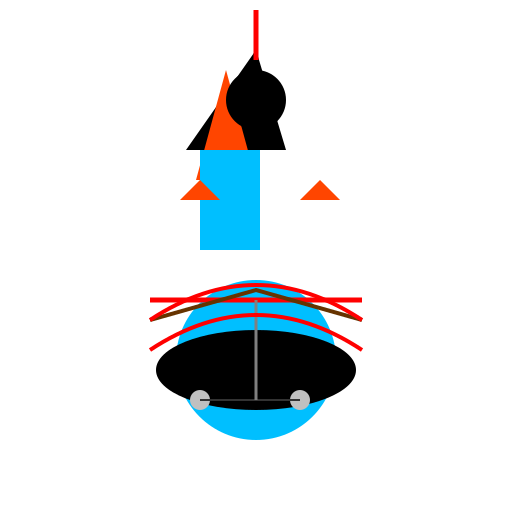
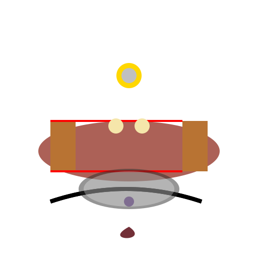
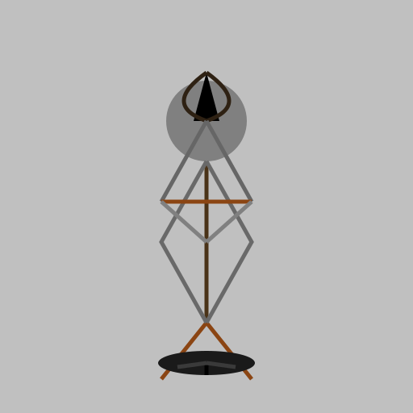
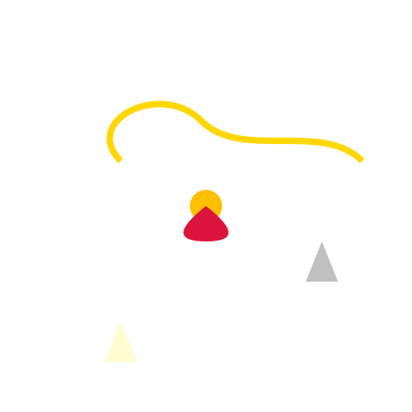
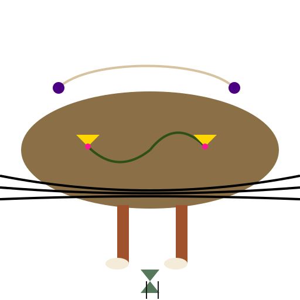

# Profile Gallery

Visual samples for all 13 generation profiles. Each SVG was generated with `openai/gpt-4o-mini` via OpenRouter using the tags `star, water`. Regenerate with `pnpm samples:live` to refresh.

---

## A. Pure Aesthetics

### sagan — Voyager Golden Record

*Radial symmetry, gold background, technical diagram. 48 elements max.*

### picasso — Single-Line Drawing

*Continuous flowing line, black on white, pure economy. 20 elements max.*

### contento — Rich Complexity

*Layered density, gradients, patterns, visual abundance. 80 elements max.*

---

## B. Compositional

### dictionary — Visual Lexicon

*Semantic primitives in grid/cluster formation. 60 elements max.*

---

## C. Psychological & Philosophical

### freud — Psychological Layers

*Concentric layers: id (warm sepia) → ego (gray) → superego (cool gray). 70 elements max.*

### jung — Archetypal Symbols

*Mandala-like radial symmetry, symbolic animals, sacred geometry. 50 elements max.*

### nietzsche — Genealogy of Concepts

*Apollonian/Dionysian tension, genealogical diagram, eternal recurrence. 100 elements max.*

---

## D. Epistemological

### booch — Engineering Clarity

*System diagram, boxes and lines, honest structure. 70 elements max.*

### carlin — Linguistic Subversion

*Rough, crude, energetic. Expose contradictions. 80 elements max.*

### trumpa — Sacred Paradox

*Crazy wisdom, paradox, sacred/profane held together. 70 elements max.*

### rosina — Grounded Realism

*Stark, direct, unglamorous. Italian neorealist cinema style. 50 elements max.*

---

## E. Musical & Literary

### domingo — Musical Range

*Flowing curves, warm/cool integration, versatile mastery. 80 elements max.*

### gabriel — Magic Realism

*Elaborate, warm, mythic yet real. García Márquez style. 120 elements max.*

---

## Regenerating Samples

```bash
# With OpenRouter (uses your .env OPENROUTER_API_KEY or SVG_MODEL_API_KEY)
pnpm samples:live

# With a specific model
npx tsx scripts/generate-samples.ts --model=openai/gpt-4o

# Copy fresh SVGs to wiki assets
cp samples/*.svg wiki/profiles/assets/
```

---

Last updated: 2026-06-22
Generator: `scripts/generate-samples.ts` via OpenRouter (`openai/gpt-4o-mini`)
